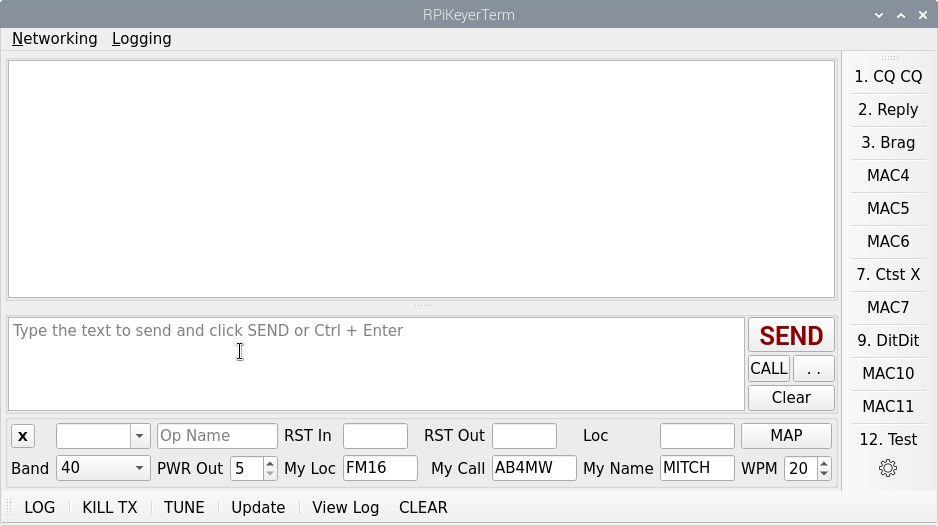

Readme for RPiKeyerTerm software

RPiKeyerTerm allows the Raspberry Pi to become a smart keyer by using
software to store macros and which maintains logging.  Logging also
includes the ability to send ADIF to the N1MM logger, to eQSL.cc, or
to QRZ.com (subscription required) via network connections.  QRZ.com
and eQSL naturally can only be done when connected to the internet, 
but if N1MM is being used in a local network, then it can aggregate 
the ADIF log entries for multiple stations.

A new addition is an audio FIR bandpass filter widget.  This widget
may be shown or hidden from the View menu.  It also requires two 
playback sound card devices to be available on the RPi.  Receive
audio is filtered and then played back on the second playback sound
card.  If the on-board RPi headphone jack is used, be sure to enable
it in the /boot/config.txt file by ensuring that the line

````
dtparam=audio=on
````
is in the file and not commented out.  A stock RPi has this value
turned on.

If you do not wish to use the audio filter, show it from the view menu
and ensure that the widget's checkbox at it's top left position is
unchecked, and then hide it again with the View menu.



RPiKeyerTerm uses GPIO to initiate keying to the radio.  The radio is
configured for straight key operation and a two component keying circuit
consisting of a 2N2222 transistor and a 1000 ohm resistor are all that
are needed for a reliable keyer for most any radio.  A simple circuit
design is provided in the file KeyCircuit.png.


Build Instructions

REQUIRED LIBRARIES IN Raspberry Pi OS to run OR to build from source.

````
sudo apt install gpiod libgpiod-dev libgpiod-doc qtbase5-dev qtmultimedia5-dev
````

To build from source:
````
cd ~
mkdir src
cd src
git clone https://github.com/guitarpicva/RPiKeyerTerm.git
cd RPiKeyerTerm
mkdir build
cd build
qmake ..
make -j4
# NOTE: do a normal user install and NOT a super-user install
# because the program will be installed in a new RPiKeyerTerm
# folder in the user's home folder.
make install
````

The above process SHOULD leave the user with a "/home/login/RPiKeyerTerm"
folder which has the following in it:

````
pi@pico:~/RPiKeyerTerm $ ls -l
lrwxrwxrwx 1 pi pi     46 May 20 16:34 libFIRFilterLib.so -> /home/pi/RPiKeyerTerm/libFIRFilterLib.so.1.0.0
lrwxrwxrwx 1 pi pi     46 May 20 16:34 libFIRFilterLib.so.1 -> /home/pi/RPiKeyerTerm/libFIRFilterLib.so.1.0.0
lrwxrwxrwx 1 pi pi     46 May 20 16:34 libFIRFilterLib.so.1.0 -> /home/pi/RPiKeyerTerm/libFIRFilterLib.so.1.0.0
-rwxr-xr-x 1 pi pi  73624 May 20 16:46 libFIRFilterLib.so.1.0.0
-rwxr-xr-x 1 pi pi 223944 May 20 16:46 RPiKeyerTerm
-rwxr-xr-x 1 pi pi    113 May 20 07:55 RPiKeyerTerm.sh
````

If you wish to create a shortcut on your desktop system, use the
RPiKeyerTerm.sh shell script for that purpose, otherwise, use that
shell script to start the program.  First run will create a logs
folder and a couple of .ini files for settings.
