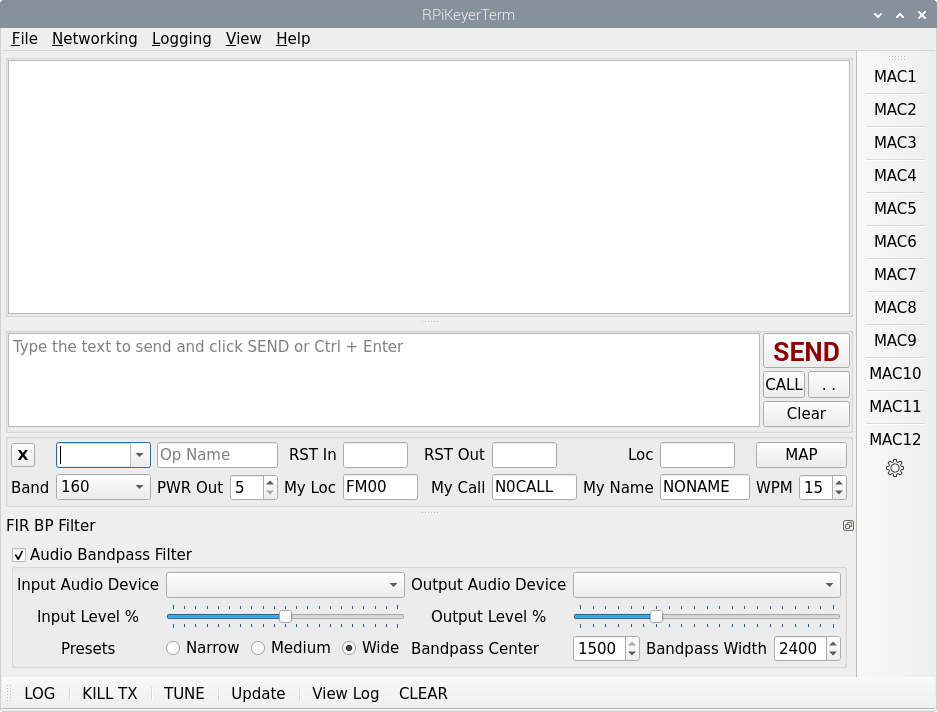

Readme for RPiKeyerTerm software

RPiKeyerTerm allows the Raspberry Pi to become a smart keyer by using
software to store macros and which maintains logging.  Logging also
includes the ability to send ADIF to the N1MM logger, to eQSL.cc, or
to QRZ.com (subscription required) via network connections.  QRZ.com
and eQSL naturally can only be done when connected to the internet, 
but if N1MM is being used in a local network, then it can aggregate 
the ADIF log entries for multiple stations.

RPiKeyerTerm uses GPIO to initiate keying to the radio.  The radio is
configured for straight key operation and a two component keying circuit
consisting of a 2N2222 transistor and a 1000 ohm resistor are all that
are needed for a reliable keyer for most any radio.  A simple circuit
design is provided in the file Keyit.png.



`` Build Instructions

REQUIRED LIBRARIES IN Raspberry Pi OS to run OR to build from source.

````
sudo apt install gpiod libgpiod-dev libgpiod-doc qtbase5-dev
````

To build from source:
````
cd ~
mkdir src
cd src
git clone https://github.com/guitarpicva/RPiKeyerTerm.git
cd RPiKeyerTerm
mkdir build
cd build
qmake ..
make -j4
````
If all goes well, run with ./RPiKeyerTerm &

From the "build" folder, create an application installation area:
````
mkdir ~/RPiKeyerTerm
cp RPiKeyerTerm ~/RPiKeyerTerm
cd ~/RPiKeyerTerm
touch RPiKeyerTerm.sh
chmod +x RPiKeyerTerm.sh
nano RPiKeyerTerm.sh
````
Make the contents of this file to be:

````
#!/bin/bash
cd ~/RPiKeyerTerm
./RPiKeyerTerm &
exit 0
````

Save the file with Ctrl-O <Enter> Ctrl-X
